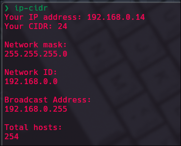

# IP-CIDR Converter

A Python utility that takes an IP address and a CIDR (Classless Inter-Domain Routing) value as input and calculates:

- The Network Mask
- The Network ID
- The Broadcast Address
- The total number of usable hosts in the network

## Features

- Validates IP address and CIDR inputs.
- Calculates key networking information with precise binary operations.
- Provides clear and formatted output for ease of use.

## Prerequisites

- Python 3.6 or newer.

## Installation

1. Clone the repository or download the script.
2. Ensure the script has executable permissions:

```bash
chmod +x ip-cidr
```

3. Ensure Python is installed and available in your PATH. 

## Usage

1. Run the script from the repo folder or add it to a rute of your PATH like "/usr/bin/".
2. Input the IP address and CIDR when prompted.
3. View the results.


## Input Validation

1. IP Address: Must be a valid IPv4 address (e.g., 192.168.1.1).
2. CIDR: Must be a number between 0 and 32.

If the inputs are invalid, an error message will be displayed.

## TODO

Implementate argparse lib for a more ergonomic usage in command-line:
```bash
ip-cidr 192.168.0.14/24
```
